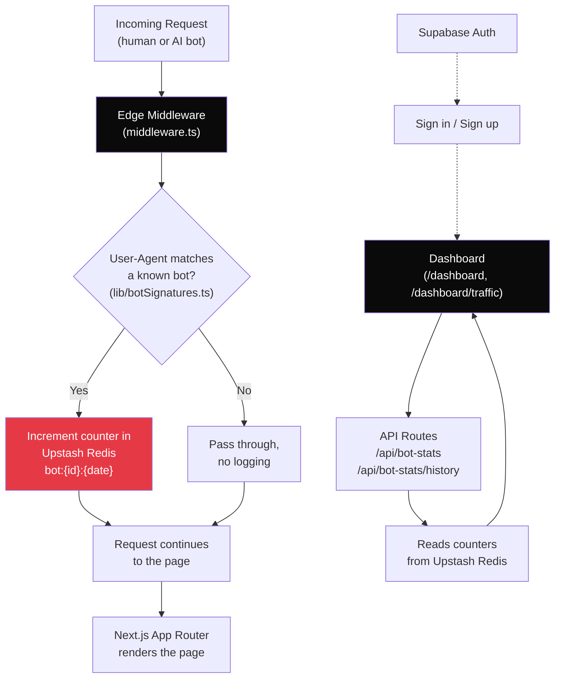

# Promptwatch

🔗 **Live demo:** https://promptwatch.vercel.app

## What does it do?

Promptwatch is a middleware-based tool that tracks AI crawler activity on a website.
AI companies (OpenAI, Anthropic, Perplexity, etc.) send bots that constantly crawl
websites, but site owners have no visibility into this and no real way to control it.

Promptwatch detects known AI bots (GPTBot, ClaudeBot, PerplexityBot, and others) in
real time, logs how often each one visits, and shows the owner exactly which bots are
hitting their site and how much. This gives the owner the ability to decide which bots
to allow and which to restrict — control they don't currently have with a standard
website.

## Current status

**Working (real, live data — not seeded/demo):**
- Edge Middleware detects known AI crawlers by User-Agent on every request
- Bot hits are logged in real time to Redis
- `/dashboard/traffic` shows real crawler activity — live, not synthetic
- `/dashboard` (Overview) shows real visit counts and real pending actions
- Authentication via Supabase (email/password + Google)

**In progress:**
- Policy/control panel — allow, throttle, or block specific bots
- Middleware enforcement of those policies (currently detection-only, no blocking yet)
- Path-level logging (which specific page a bot visited — currently only total site hits are tracked)

**Not yet built:**
- Prompt tracking and competitor-citation detection (shown as "Coming Soon" in the UI — not part of the current core feature)

## How it works

Every request to the site passes through Edge Middleware before reaching a page.
The middleware reads the request's `User-Agent` header, checks it against a list of
known AI crawler signatures (`lib/botSignatures.ts`), and if it matches, increments a
counter in Upstash Redis keyed by bot and date. The request then continues normally —
this phase only observes, it doesn't block anything yet. The dashboard reads these
Redis counters to show live traffic.

### System design



**Flow summary:**
1. A request hits the site (from a real user or an AI bot).
2. Edge Middleware intercepts it before it reaches any page.
3. The `User-Agent` header is checked against known bot signatures.
4. If matched, a counter is incremented in Redis (`bot:{botId}:{date}`), and the request continues untouched.
5. The dashboard (behind Supabase-authenticated login) reads these Redis counters through API routes and displays real, live crawler activity.

## Tech stack

| Tool | Why |
|---|---|
| **Next.js 15 (App Router) + Edge Middleware** | Bot detection has to happen before a request reaches the page, at the edge — regular server-side logic runs too late in the request lifecycle for this |
| **Upstash Redis (REST-based)** | Fast, Edge-compatible key-value store for per-request counters; a traditional database is too slow to query on every single request |
| **Supabase** | Authentication (email/password + Google), and planned storage for bot policy settings |
| **Vercel** | Deployment, free tier |

## Setup

```bash
git clone <repo-url>
cd assignment
npm install
```

Add a `.env.local` file with:
```bash
npm run dev
```

Open http://localhost:3000, sign up or sign in, then navigate to:
- `/dashboard` — Overview
- `/dashboard/traffic` — real-time AI bot traffic
- `/dashboard/actions` — action triage queue

## What's next

- Build the per-bot policy panel (Allow / Throttle / Block)
- Enforce policies directly in middleware (currently logging only, no blocking)
- Add path-level logging so "Top Pages" reflects real data instead of an empty state
- Package the middleware so other Next.js sites can install it without touching this codebase

## AI tool usage

Used Claude to plan the architecture, reason through the shift from the original
assignment (citation-tracking dashboard) to the current bot-detection/control product,
and to generate implementation prompts executed via Antigravity. All generated code was
reviewed before committing — specifically the middleware logic, Redis key scheme, and
the real-data wiring for the dashboard.
