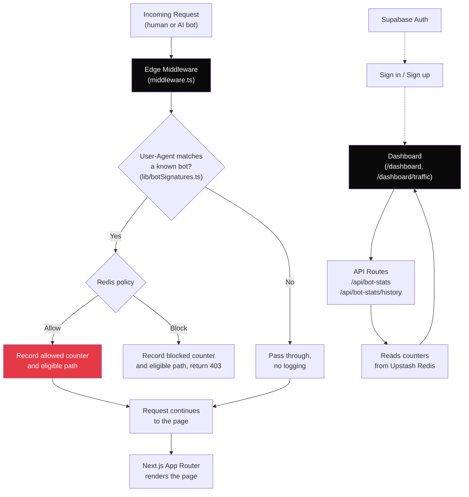

# Promptwatch

🔗 **Hosted site:** https://promptwatch.vercel.app

The current product target is **one owner and one website per self-hosted
deployment**, with a dedicated Redis database. See [single-owner setup](docs/SELF_HOSTING.md)
before deploying or upgrading.

## What does it do?

Promptwatch is a middleware-based tool that tracks AI crawler activity on a website.
AI companies (OpenAI, Anthropic, Perplexity, etc.) send bots that constantly crawl
websites, but site owners have no visibility into this and no real way to control it.

Promptwatch detects known AI bots (GPTBot, ClaudeBot, PerplexityBot, and others) in
real time, logs how often each one visits, and shows the owner exactly which bots are
hitting their site and how much. This gives the owner the ability to decide which bots
to allow and which to restrict — control they don't currently have with a standard
website.

## Current status

**Implemented:**

- Middleware matches known HTTP crawler User-Agent tokens on public requests.
- Optional direct-Vercel IP observations compare five crawlers against fresh
  official vendor ranges, without saving visitor IPs or changing access rules.
  See [crawler identity setup](docs/CRAWLER_IDENTITY.md).
- Optional protected daily feed refresh, with overlap protection and recorded
  per-feed outcomes. See [automatic refresh setup](docs/AUTOMATIC_FEED_REFRESH.md).
- A locally packed collector can be installed on a separate Next.js 15 site,
  sharing this single-owner dashboard's Redis database. See
  [collector installation](docs/COLLECTOR_INSTALLATION.md).
- Allow/Block policies are read and saved in Redis, the authoritative store.
- Settings shows the latest 200 owner policy changes, recorded together with
  each actual rule update. Selecting an unchanged rule creates no history entry.
- A confirmed Block returns 403 even if its analytics write fails. Policy read
  outages fail open to keep the site available.
- Traffic charts show 30 days of allowed requests, with separate blocked totals
  and blocked-only crawlers included in summaries.
- Top Pages shows allowed/blocked requests on configured public paths, with
  bounded storage and a collection start date. Query strings are not stored.
- Reports provide 7/30-day totals and daily/crawler CSV exports.
- Report crawler, outcome and UTC date filters apply consistently to totals,
  tables and CSV exports without collecting additional visitor data.
- Tracking Health separates Redis connectivity, collector evidence, and recorded
  failures, with an optional isolated storage self-check.
- Action Centre and Overview derive recommendations from actual crawler counters:
  request increases, repeated blocks, and newly observed activity. Reviews are
  saved in Redis. See [action rules and limits](docs/CRAWLER_ACTIONS.md).
- Supabase authentication supports email/password and Google. Dashboard APIs and
  pages require the server-configured owner UUID.
- Site name and origin are validated and saved in owner-only settings, with a
  storage reload before success is shown. Saving details does not install a collector.

**Still demo-backed or incomplete:**

- Prompt/competitor screens contain examples; no real citation collection exists.
- Notifications, external API keys and bulk deletion are unavailable and explicitly
  described as such in Settings; there are no pretend keys or working toggles.
- Throttling, hosted second-site verification, and continuous uptime
  monitoring are not implemented. Crawler matches do not prove AI citations.

## How it works

Every request to the site passes through Edge Middleware before reaching a page.
The middleware reads the request's `User-Agent` header, checks it against a list of
known AI crawler signatures (`lib/botSignatures.ts`), and if it matches, reads a
policy in Upstash Redis keyed by bot. A Block rule returns 403; otherwise the
request continues. A Redis script records allowed or blocked counters by UTC
date, plus eligible public path counts. The owner dashboard reads those counters
through authenticated APIs.

### System design


```mermaid
flowchart TD
    A["Incoming Request<br/>(human or AI bot)"] --> B["Edge Middleware<br/>(middleware.ts)"]
    B --> C{"User-Agent matches<br/>a known bot?<br/>(lib/botSignatures.ts)"}
    C -- "Yes" --> P{"Redis policy"}
    P -- "Allow" --> D["Record allowed counter<br/>and eligible path"]
    P -- "Block" --> X["Record blocked counter<br/>and eligible path, return 403"]
    C -- "No" --> E["Pass through,<br/>no logging"]
    D --> F["Request continues<br/>to the page"]
    E --> F
    F --> G["Next.js App Router<br/>renders the page"]

    H["Dashboard<br/>(/dashboard, /dashboard/traffic)"] --> I["API Routes<br/>/api/bot-stats<br/>/api/bot-stats/history"]
    I --> J["Reads counters<br/>from Upstash Redis"]
    J --> H

    K["Supabase Auth"] -.-> L["Sign in / Sign up"]
    L -.-> H

    style D fill:#e63946,color:#fff
    style B fill:#0A0A0A,color:#fff
    style H fill:#0A0A0A,color:#fff
```

**Flow summary:**

1. A request hits the site (from a real user or an AI bot).
2. Edge Middleware intercepts it before it reaches any page.
3. The `User-Agent` header is checked against known bot signatures.
4. If matched, the stored policy decides whether the request proceeds or returns 403.
   Existing `bot:{botId}:{date}` and `blocked:{botId}:{date}` counters are retained.
   Path logging defaults to the homepage; enable other public prefixes explicitly.
5. The configured owner reads traffic and page counters through protected APIs.
   A User-Agent match is a claim of identity, not verified provenance.

## Tech stack

| Tool                                          | Why                                                                                                                                                    |
| --------------------------------------------- | ------------------------------------------------------------------------------------------------------------------------------------------------------ |
| **Next.js 15 (App Router) + Edge Middleware** | Bot detection has to happen before a request reaches the page, at the edge — regular server-side logic runs too late in the request lifecycle for this |
| **Upstash Redis (REST-based)**                | Fast, Edge-compatible key-value store for per-request counters; a traditional database is too slow to query on every single request                    |
| **Supabase**                                  | Authentication (email/password + Google); legacy SQL policy access must be locked using the supplied migration                                         |
| **Vercel**                                    | Deployment, free tier                                                                                                                                  |

## Setup

```bash
git clone https://github.com/pjha26/promptwatch.git
cd promptwatch
npm ci
```

Create `.env.local` from `.env.example` if it does not already exist, and fill in
your Supabase/Upstash values. Create your owner account, set
`PROMPTWATCH_OWNER_ID` to its Supabase UUID, and follow the legacy-table migration
steps in [SELF_HOSTING.md](docs/SELF_HOSTING.md). Then run:

```bash
npm run dev
```

Open http://localhost:3000, sign up or sign in, then navigate to:

- `/dashboard` — Overview
- `/dashboard/traffic` — real-time AI bot traffic
- `/dashboard/actions` — action triage queue
- `/dashboard/reports` — traffic reports and CSV downloads
- `/dashboard/health` — connection status, collector evidence and storage self-check
- `/dashboard/identity` — optional IP observations and official feed refresh
- `/dashboard/settings` — enforced Allow/Block rules

Public path collection is configured with `PROMPTWATCH_PUBLIC_PATH_PREFIXES`.
For example, `/,/docs,/blog` enables the homepage, docs and blog. Each UTC day
stores up to 200 distinct paths for each outcome, with 30-day retention. Reports
are not exhaustive after a cap is reached; per-bot totals keep counting.

## Development checks

Use Node.js 22 and `npm ci` with the committed lockfile. Run `npm run check`
for lint (zero warnings), TypeScript, regression tests, production build, and
signed-out API smoke checks. Individual commands are `npm run lint`,
`npm run typecheck`, `npm test`, `npm run build`, and `npm run test:auth`.
The smoke test requires a completed build and disables Redis writes.

GitHub Actions runs these checks on pushes and pull requests using dummy auth
configuration and no production secrets. Builds download Google fonts, so they
need network access. Passing CI does not verify live owner login or Redis.
The workflow does not configure branch protection or deploy the application.

`npm run test:collector` builds and packs the shared collector, installs it in a
separate temporary Next.js site, and tests its Edge middleware with isolated
storage replies. CI runs this check too. It needs network access for dependency
installation and does not contact the owner's Supabase or Redis services.

CI also runs `npm run test:redis` against its disposable Redis container, checking
actual collector and policy-history scripts. To run that check locally, provide
`PROMPTWATCH_TEST_REDIS_CONTAINER` with a disposable Redis 7 container ID; Docker
must be running. Tests use unique key prefixes and never clear the database.

`npm run test:transport` measures the real Redis HTTP client against controlled
local responses and timeouts, without live service access. See
[collector performance and release checks](docs/COLLECTOR_PERFORMANCE.md) for
measurements, the two-second budget and remaining deployment verification.

## What's next

- Persist real site settings
- Validate the collector against active services and measure request latency
- Add throttling and verified crawler identity where vendors support it
- Verify the collector package on a real second-site deployment

The detailed sequence and completed milestones are in
[IMPLEMENTATION_PLAN.md](docs/IMPLEMENTATION_PLAN.md).

## AI tool usage

Used Claude to plan the architecture, reason through the shift from the original
assignment (citation-tracking dashboard) to the current bot-detection/control product,
and to generate implementation prompts executed via Antigravity. All generated code was
reviewed before committing — specifically the middleware logic, Redis key scheme, and
the real-data wiring for the dashboard.

Codex with Ponytail continued the product implementation: traffic reports,
single-owner authorization, Redis policy authority, bounded public-path analytics,
and focused regression tests. Local test/build results and remaining live-service
verification limits are documented with each milestone; no production database
migration or owner configuration was automatically applied.
